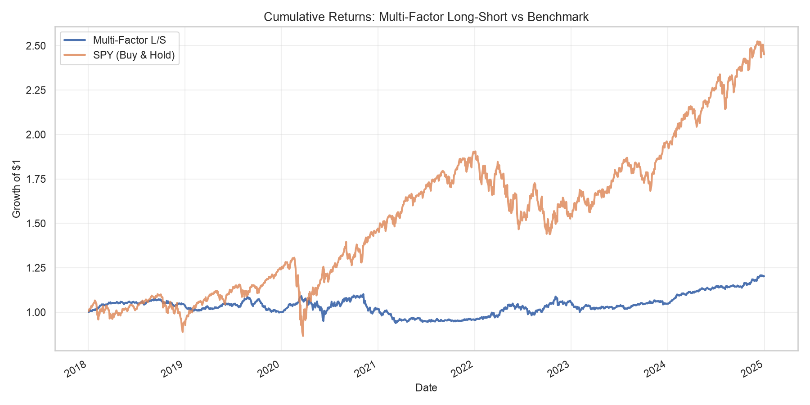
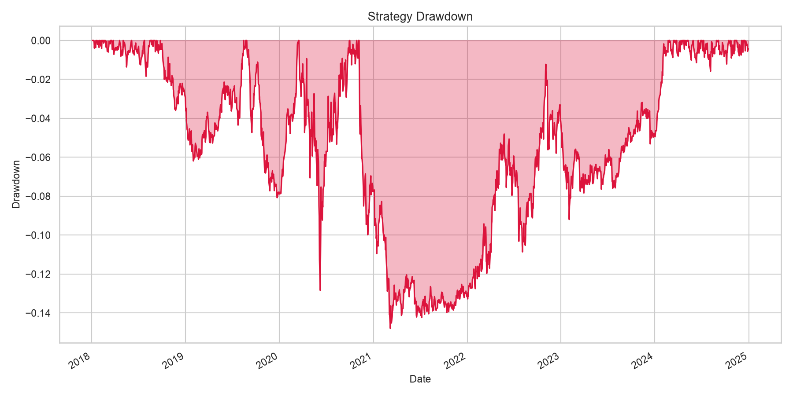
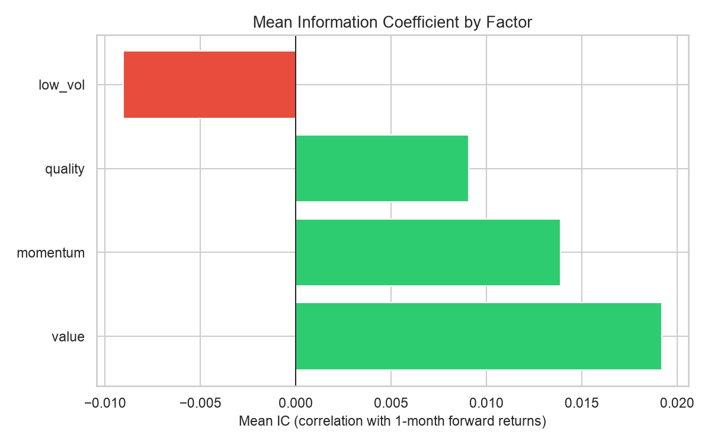
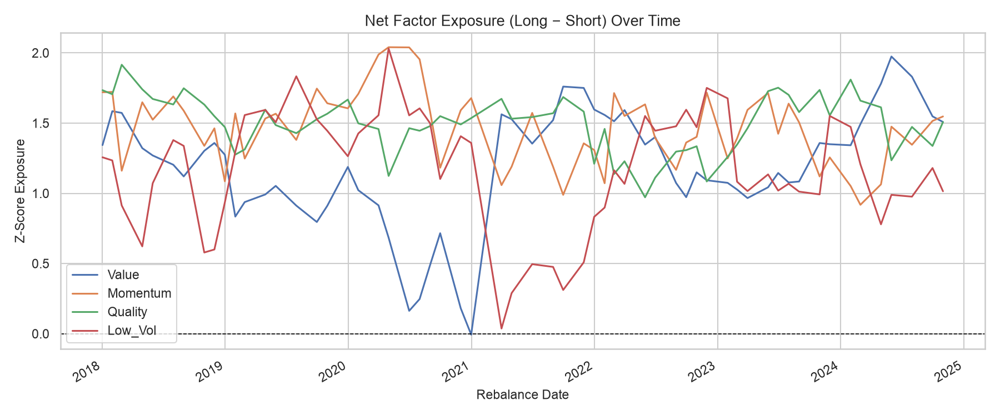
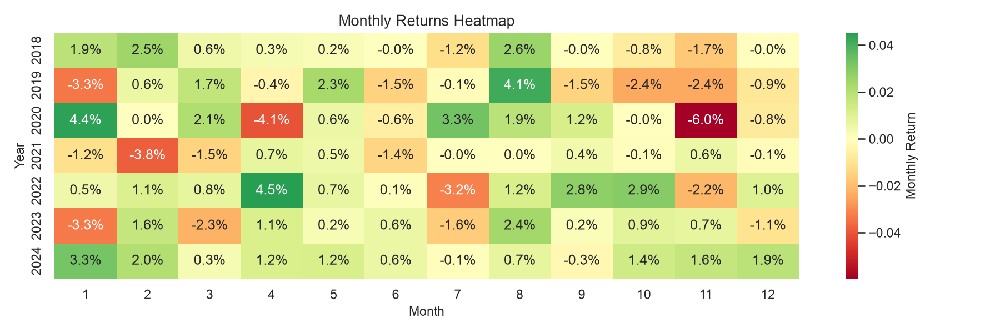

# Multi-Factor Stock Ranking & Long-Short Backtest

A quantitative equity strategy that ranks large-cap US stocks on four canonical factors — **value, momentum, quality, and low-volatility** — and backtests a monthly-rebalanced, dollar-neutral long-short portfolio built from those rankings.

## Overview

- **Universe:** 120 large-cap US stocks with sufficient price history (S&P 500 subset)
- **Period:** 2018–2024 (59 monthly rebalances)
- **Strategy:** Long top 20% / short bottom 20% by composite factor score, equal-weighted, dollar-neutral
- **Costs:** 10 bps transaction cost applied to turnover at each rebalance

## Results

| Metric | Value |
|---|---|
| Total Return | 20.3% |
| Annualized Return | 2.7% |
| Annualized Volatility | 7.4% |
| Sharpe Ratio | -0.14 |
| Max Drawdown | -14.8% |
| Beta vs SPY | -0.10 |
| Alpha vs SPY | -0.3% |
| Information Ratio | -0.53 |

**Factor Information Coefficients** (correlation with next-month returns):

| Factor | IC | % Positive Months |
|---|---|---|
| Value | +0.019 | 55% |
| Momentum | +0.014 | 53% |
| Quality | +0.009 | 55% |
| Low Volatility | -0.009 | 49% |

### Cumulative Returns vs. SPY


The strategy is designed to be market-neutral (beta ≈ -0.10), so it does not track SPY's bull-market gains — that's expected, not a bug. Notably, the strategy held up far better than SPY during the March 2020 crash, which is the point of market neutrality: isolating stock-selection skill from market direction.

### Drawdown


Max drawdown of -14.8% occurred in 2021, with a slow multi-year recovery — a real weakness of this specific factor blend during that regime.

### Factor Predictive Power


Value was the strongest and most consistent signal across the backtest period. Low-volatility had a slightly negative IC, underperforming as a standalone signal in this sample.

### Net Factor Exposure Over Time


### Monthly Returns Heatmap


November 2020 (-6.0%) was the worst single month, coinciding with the COVID vaccine announcement, which triggered a sharp value/momentum rotation that hurt many factor strategies industry-wide.

## Methodology

**Factors** (equal-weighted composite, cross-sectionally z-scored each month, winsorized at 1st/99th percentile):

| Factor | Definition | Rationale |
|---|---|---|
| Value | Trailing EPS ÷ price | Cheap stocks tend to outperform (Fama-French HML) |
| Momentum | 12-month return, skipping most recent month | Winners tend to keep winning (Jegadeesh & Titman, 1993); skipping the last month avoids short-term reversal |
| Quality | 60% ROE + profit margin, 40% price stability | Profitable, stable firms tend to outperform (Novy-Marx, 2013) |
| Low Volatility | Negative 60-day annualized volatility | Low-vol anomaly: lower-risk stocks often have better risk-adjusted returns |

**Portfolio construction:** Every month-end, all stocks are ranked by composite score. Long the top 20% (equal-weighted), short the bottom 20% (equal-weighted), sized for zero net market exposure.

**Backtest engine:** Event-driven daily simulation (not vectorized), with transaction costs applied on turnover at each rebalance.

**Why a fundamental lag?** Free fundamental data from yfinance is a current snapshot, not point-in-time. A lag is applied to approximate the delay before quarterly reports are actually public, reducing look-ahead bias.

**Why z-scores?** Cross-sectional z-scoring puts factors on the same scale (e.g., a P/E of 15 vs. a momentum of 0.3 aren't otherwise comparable) and is standard practice in institutional factor models.

## Key Takeaways

- The strategy achieved its core design goal — near-zero market beta — but produced a negative Sharpe ratio and alpha over this specific period, reflecting the well-documented difficulty of market-neutral strategies during a sustained bull market (2018–2024).
- Value was the most reliable standalone factor; low-volatility detracted from performance in this sample.
- Honest limitations: fundamentals used are not truly point-in-time (production systems use Compustat/FactSet), the universe is not survivorship-bias-free (current S&P 500 constituents used throughout), there's no slippage model beyond flat transaction costs, and shorting assumes full borrow availability.

## Tech Stack

- Python 3.10+
- `pandas` / `numpy` — vectorized factor computation
- `yfinance` — market data
- `matplotlib` / `seaborn` — visualization
- `scipy` — statistical metrics

## Possible Extensions

- Point-in-time fundamentals (e.g., via Compustat) to remove look-ahead bias
- Survivorship-bias-free universe construction
- Sector-neutral long-short construction
- Dynamic/regime-aware factor weighting
- Walk-forward optimization instead of a single static backtest window

## Running It

```bash
python3 -m venv .venv
source .venv/bin/activate
pip install -r requirements.txt
python main.py
```

Outputs (charts + CSVs) are saved to `output/`.

## Customization

Edit `config.yaml` to change:
- Stock universe (`universe.tickers`)
- Backtest period (`backtest.start_date`, `end_date`)
- Factor weights (`factors.weights`)
- Long/short percentiles (`backtest.long_pct`, `short_pct`)
- Transaction costs (`backtest.transaction_cost_bps`)

## Project Structure

```
finance project/
├── main.py              # entry point
├── config.yaml           # universe, weights, dates
├── requirements.txt
├── src/
│   ├── data_loader.py    # price + fundamentals data
│   ├── factors.py        # factor computation
│   ├── portfolio.py      # long-short portfolio construction
│   ├── backtest.py       # event-driven simulation
│   ├── analytics.py      # performance metrics
│   └── visualize.py      # charts
├── data/                 # cached data (auto-created)
└── output/                # backtest results (auto-created)
```
